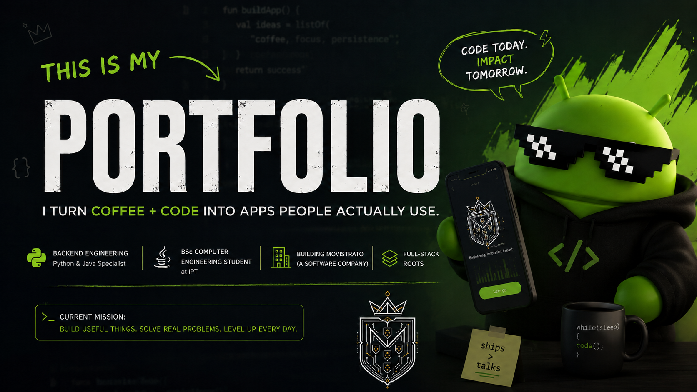

 <div align="center">
  <h1>Miguel Pereira Santos</h1>
  <h3>Backend Software Engineer in Training</h3>
  <p>
    <a href="https://github.com/imperador1k"></a>
    <a href="https://www.linkedin.com/in/miguel-sant0s/"></a>
    <a href="mailto:contacto@miguelweb.dev"></a>
  </p>
  <p>
    <strong>Java</strong> · <strong>Python</strong> · APIs · Systems · Databases · Cloud
  </p>
  <p><em>Building towards backend and distributed systems through fundamentals, products and deliberate practice.</em></p>
  <p>
    
    
    
  </p>
</div> <p align="center">
  
</p>   

<div align="center">

</div>   

## `whoami`

<table>
<tr>
    <td width="68%" valign="top">

```java
public final class MiguelPereiraSantos {
    String role = "Backend Software Engineer in training";
    String degree = "BSc in Computer Engineering";
    String institution = "Polytechnic Institute of Tomar";
    String direction = "Backend systems and distributed software";
    String builds = "Faro + independent product experiments";
    String principle = "Understand the system before abstracting it";
}
```

I am a **Computer Engineering student in Portugal**, deliberately training to become an excellent backend engineer. My main direction is **Java and Python**, supported by a growing understanding of databases, operating systems, networks, infrastructure and the behaviour of software in production.

I care about the layer beneath the framework: the data model, the API contract, the failure mode, the deployment boundary and the reasoning that makes a system maintainable.

```
</td>
<td width="32%" align="center" valign="middle">
  
    
  

  <strong>Portugal</strong>  

  Computer Engineering  

  2024 — 2027
</td>
```

</tr>
</table>   


## Engineering direction

```
Computer Engineering foundations
              ↓
      Backend engineering
              ↓
 Distributed systems and cloud
              ↓
     Reliable product systems
```

I am not only learning how to assemble applications with a framework. I am working towards understanding how software behaves end to end: from algorithms and memory to protocols, persistence, observability and operational trade-offs.

| Domain | What I am deliberately developing |
| --- | --- |
| **Programming** | Fluency in Java and Python, with readable, testable and explainable code. |
| **Foundations** | Algorithms, data structures, computational thinking and problem decomposition. |
| **Systems** | Operating systems, processes, memory, Linux and the boundaries between components. |
| **Networks** | HTTP, APIs, protocols, latency, communication and the realities of distributed work. |
| **Data** | SQL, PostgreSQL, relational modelling, consistency and data access patterns. |
| **Backend** | Service design, REST APIs, validation, security, testing and maintainable architecture. |
| **Infrastructure** | Git, Docker, CI/CD and cloud concepts studied with production behaviour in mind. |
| **Reliability** | Failure analysis, observability, performance, resilience and operational feedback loops. |

## Technical ecosystem

The technologies below represent tools I use, have used or am deliberately studying. They are not a claim of mastery; the strongest evidence of any skill is working software that can be inspected, tested and explained.

### Core engineering

<p>

</p>

### Backend and data

<p>

</p>

`REST APIs` · `SQL` · `PostgreSQL` · `Redis` · `Spring Boot` · `Maven`

### Systems and infrastructure

<p>

</p>

`Operating systems` · `Computer networks` · `Containers` · `CI/CD` · `Cloud concepts`

### Product-building experience

<p>

</p>

`TypeScript` · `Next.js` · `React` · `Tailwind CSS` · `Tauri` · `Capacitor` · `Supabase`

This product layer is especially connected to **Faro**. It complements my backend direction; it does not replace the central focus on Java, Python and systems engineering.

## Selected work

### [Faro](https://github.com/imperador1k/Faro) — a language-learning product in progress

<div align="center">
<a href="https://github.com/imperador1k/Faro">
    
  </a>
</div>

Faro is my main personal product: an ambitious language-learning platform centred on **reading, discovery, personalised learning and intelligent content**. I am building and reconsidering it as a cross-platform product, exploring how web, desktop and mobile experiences can support meaningful language acquisition.

| Faro explores | Product stack and experience |
| --- | --- |
| Reading and discovery | TypeScript · Next.js · React |
| Personalised learning | Tailwind CSS · Supabase |
| Intelligent content | Tauri · Capacitor |
| Cross-platform product design | Figma and iterative product exploration |

Faro is intentionally presented as a product being developed and explored. Its repository is the right place to evaluate the current implementation, direction and engineering evidence.

### [Movistrato](https://github.com/movistrato) — independent product work

[Movistrato](https://github.com/movistrato) is the identity behind my independent software-product work: an initiative through which I explore how ideas become usable software. It supports the work without overtaking my personal engineering identity.

## 2026–2027 mission

```
Foundations  →  Backend  →  Production  →  Distributed Systems
```

Over the next stage of my degree, I am focused on completing the fundamentals properly, building backend systems in Java, using Python for complementary backend, automation and applied AI work, and studying the infrastructure around real software: PostgreSQL, Linux, Docker, cloud, APIs, networking, operating systems and distributed computing.

The practical goal is simple: turn Faro and future projects into credible engineering evidence while preparing for an international backend career. I want to become less dependent on shortcuts, more capable of reasoning independently and better at explaining the trade-offs behind what I build.

## Engineering principles

> **Fundamentals before abstractions.** Understand the mechanism before hiding it.**Study failure, not only success.** Reliability begins where the happy path ends.**Prefer simple architecture.** Complexity should be justified by a real constraint.**Treat tests, security and observability as engineering.** They are part of the system, not decoration.**Use AI as leverage, never as a substitute for understanding.**

## GitHub activity

<div align="center">


&nbsp;&nbsp;


<br/><br/>


<br/><br/>


<br/><br/>

<a href="https://github.com/imperador1k">
  
</a>

</div>   


## Let’s connect

If you are interested in backend engineering, systems, product building or the difficult path from fundamentals to reliable software, I would be glad to connect.

<div align="center">
<a href="https://www.linkedin.com/in/miguel-sant0s/"></a>
  <a href="mailto:contacto@miguelweb.dev"></a>
  <a href="https://github.com/imperador1k"></a>
  <a href="https://github.com/movistrato"></a>
</div>   
 <div align="center">
  <strong>Build from first principles. Ship with intent.</strong>
</div> <!-- Profile README for imperador1k / Miguel Pereira Santos -->
